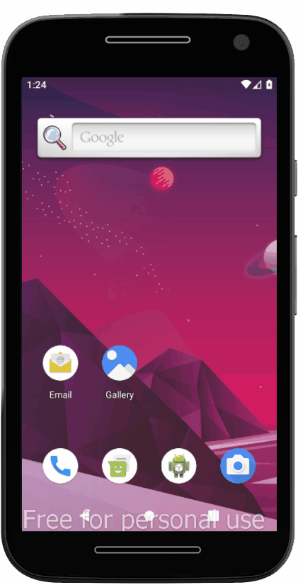

<div align="center">
</div>
<h1 align="center">Plant Manager</h1>
<p align="center">Aplicativo que gerencia cuidados com as plantas.</p>

<p align="center">
 <a href="#objetivo">Objetivo</a> •
 <a href="#tecnologias">Tecnologias</a> •
 <a href="#apresentacao">Apresentacao</a> •
 <a href="#funcionalidades">Funcionalidades</a> • 
 <a href="#instalacao">Instalação</a> •
 <a href="#utilizacao">Utilização</a> •
 <a href="#autor">Autor</a> •  
 <a href="#licenca">Licença de uso</a>
</p>

<h2 id="objetivo">🎯 Objetivo</h2>
<p>Aplicativo desenvolvido durante a semana NLW#5 da <a href="https://rocketseat.com.br/">Rocketseat</a> como forma de aprimorar meus conhecimentos nas tecnologias React e React Native.</p>
<p>O layout original do plantmanager está disponível <a href="https://www.figma.com/file/IhQRtrOZdu3TrvkPYREzOy/PlantManager/duplicate?node-id=0%3A1">aqui</a></p>

<h2 id="tecnologias">🛠 Tecnologias</h2>

<p>Configurações do ambiente disponível <a href="https://www.notion.so/Configura-es-do-ambiente-79e0e4c3e992462a9b11f2745b0f2785">aqui</a></p>

<ul>
  <li>
    
    <a href="https://nodejs.org/en/">Node.js</a>
  </li>
  <li>
    
    <a href="https://expo.io/">Expo</a>
  </li>
  <li>
    
    <a href="https://reactjs.org/">React</a>
  </li>
  <li>
    
    <a href="https://reactnative.dev/">React Native</a>
  </li>
</ul>

<p>Caso queria executar em um dispositivo virtual, uma das seguintes ferramentas pode ser usada:</p>
<ul>
  <li>
    
    <a href="https://developer.android.com/studio">Android Studio</a>
    ou
    
    <a href="https://www.genymotion.com/">Genymotion</a>
  </li>
</ul>

<h2 id="apresentacao">📺 Apresentação</h2>

<div align="center"></div>

<h2 id="funcionalidades">✅ Funcionalidades</h2>

<ul style="list-style: none;">
  <li>[X] Armazenamento do nome do usuário</li>
  <li>[X] Listagem de plantas</li>
  <li>[X] Cadastro plantas</li>
  <li>[X] Remoção da planta</li>
  <li>[X] Notificação de cuidado com planta</li>
</ul>

<h2 id="instalacao">🏃 Instalação</h2>

Clone o repositorio, depois entre nele e instale as dependências 
```Bash 
  git clone https://github.com/Diego-MB/nlw5_plantmanager.git
  cd plantmanager
  yarn install 
```

<h2 id="utilizacao">👷 Utilização</h2>

Dentro do repositório execute o comando abaixo, substitua **ENDEREÇO DE IP DA SUA MAQUINA** pelo endereço de IP da sua maquina
```Bash 
    yarn start
    json-server ./src/services/server.json --host ENDEREÇO DE IP DA SUA MAQUINA --port 3333
```
<h2 id="autor">💻 Autor</h2>
<p>Por Diego Maroldi Barreiros 🏡 Me encontre:</p>

[](https://www.linkedin.com/in/diego-m-6a1b90a6/)
[](mailto:diegomaroldi@gmail.com)

<h2 id="licenca">📝 Licença de uso</h2>
<p>Este projeto está sob a licença do MIT.</p>